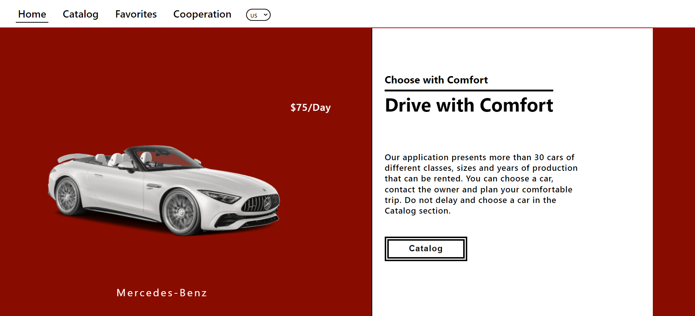
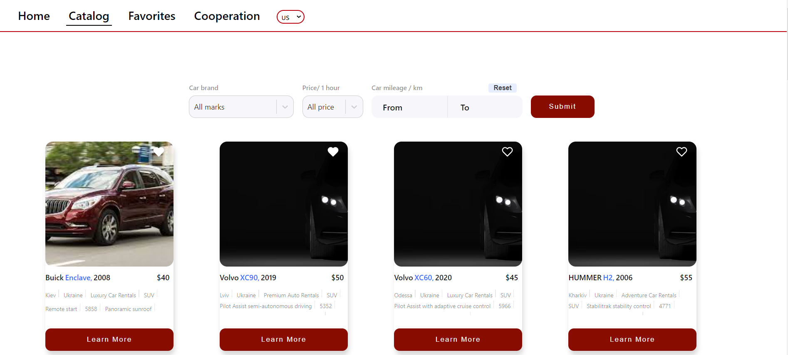
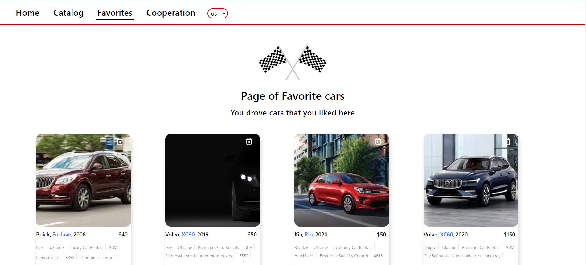
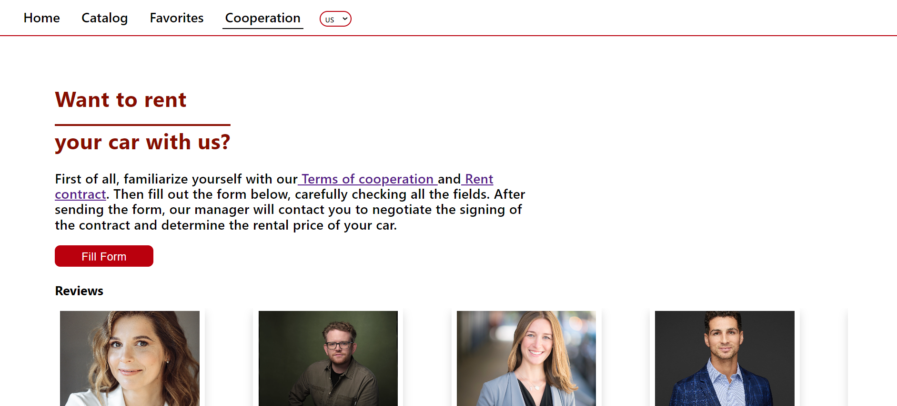

Car Rent (https://katerynakarabanova.github.io/Car-Rent/)

This project was created using [goitacademy/react-homework-template].
 During the project's development, the following libraries
were utilized:

For styling: styled-components, Swiper, Select, react-slick. For database
operations: Axios, Redux Toolkit. For getting form data user react-hook-forms.
The back-end was created using the mockApi service (https://mockapi.io). The
application consists of four pages: Home: The home page features a swiper for
showcasing some available cars. It includes the site's name and a brief
description. On desktop you have an opportunity to view car salon also.

Catalog: On the Catalog page, users can choose from 12 cars. Clicking the "Load
more" button loads an additional 12 cars. The page also provides filtering
options based on three categories (Car brand, Price/1 hour, Car mileage/km).
Users can select their desired car brand, price, and car mileage using these
filters. Each car card displays a brief description and a photo. If users want
to learn more about a specific car, clicking the "Learn More" button opens a
modal window with more detailed information about the car. Most importantly, the
modal window features a "Rental car" button, allowing users to contact the
company and book the car. Each car card also includes a heart-shaped button that
allows users to add the car to their favorites. 
Favorites: The Favorites page automatically displays the cars that users have
selected as favorites. Users can manage this list (remove cars from favorites).
By clicking "Load more," users can view more detailed information and make a car
reservation.  Cooperation: On this pafe you can fill
cooperation form and check reviews. A navigation menu is available on each page
for quick site navigation. 
